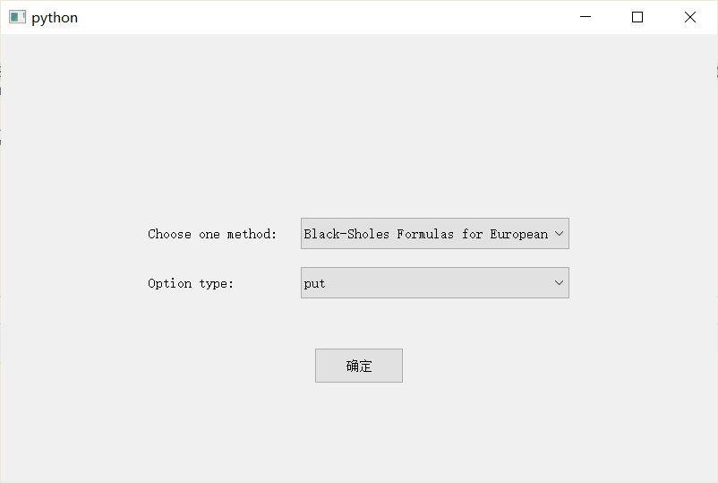
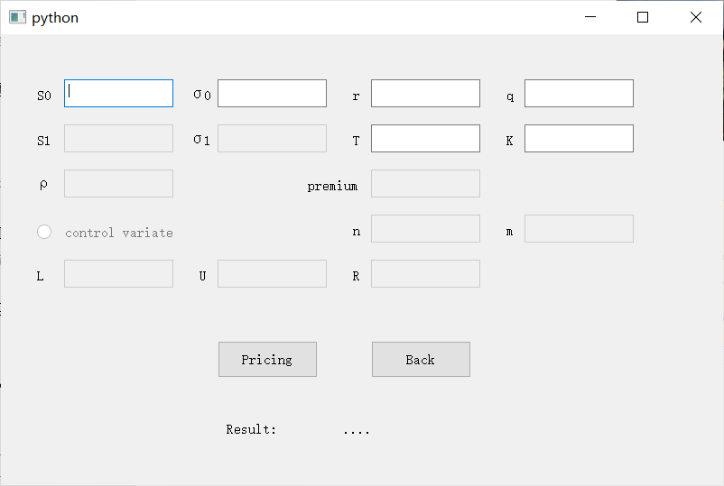
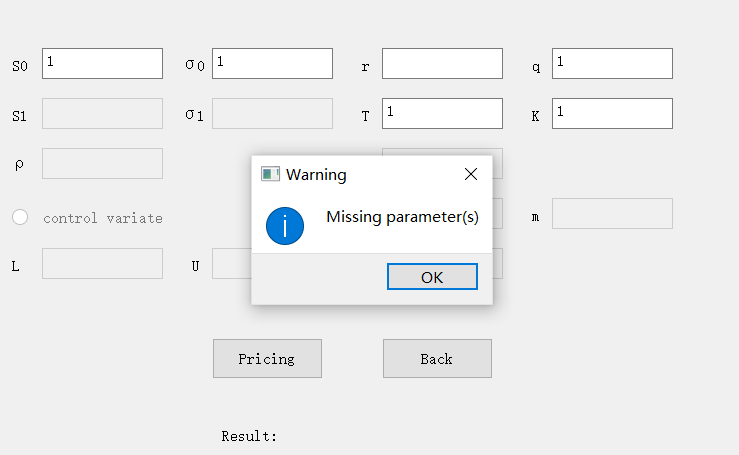
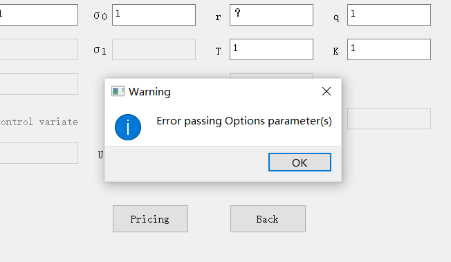

## 1 Contribution


## 2 Interface 

We use PyQt to build our interface. Run `MainInterface.py` to start the application.

Picture below shows the entrance page: user can choose the method from the list, and choose either 'call' or 'put' type. Click confirm to next step.




Here is the interface for user to input the parameters and calculate the result. Unnecessary input boxes will be disabled. User can input the numbers into boxes, and after 



If at least one of the parameters is missing, there will be an alert:



If at least one of the parameters is in wrong format, there will be an alert:




## 3 Function Description

The basic idea of our implement is to create class for each option type, and call the method inside the class to calculation the expected output. For each class, we initial the object with its required parameters, and call the function to get the result.  

For Class `BlackScholes`, `ClosedFormAsian`, `ClosedFormBasket`, `ImpliedVolatility`, they only require the calculation of given formula, thus, we only need to call the function `get_result`, and get the option price or implied volatility depending on the demanding task. 


And for other classes, here takes `MonteCarloAsianVC` as example. The program is completed as these steps:

- Generate stock price paths (using `price_path` and calculate arithmetic averages

  ```python
  geometric_average = np.exp((1 / float(self.n)) * np.sum(np.log(self.price_path()), 1)) 
  ```

- Calculate payoffs

  ```python
  # call
  mc_payoff_geo = self.discount * np.maximum(geometric_average - self.K, 0)
  # put
  mc_payoff_geo = self.discount * np.maximum(self.K - geometric_average, 0)
  
  ```

- Estimate the control variate

- Calculate the control variate coefficient

- Estimate the option value

- Calculate the standard error

The `QMonteCarloKIKOPut` class is specifically designed to calculate the price and delta of KIKO put options. Distinct from classes such as `MonteCarloAsianVC`, it employs the Quasi-Monte Carlo method, focusing its research on barrier put options.


## 4 Test Cases and Analysis 
We designed four test classes to test our pricer, which are used for Asian option, basket option, American option, and KIKO put option.


